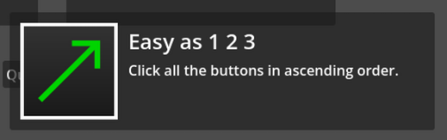
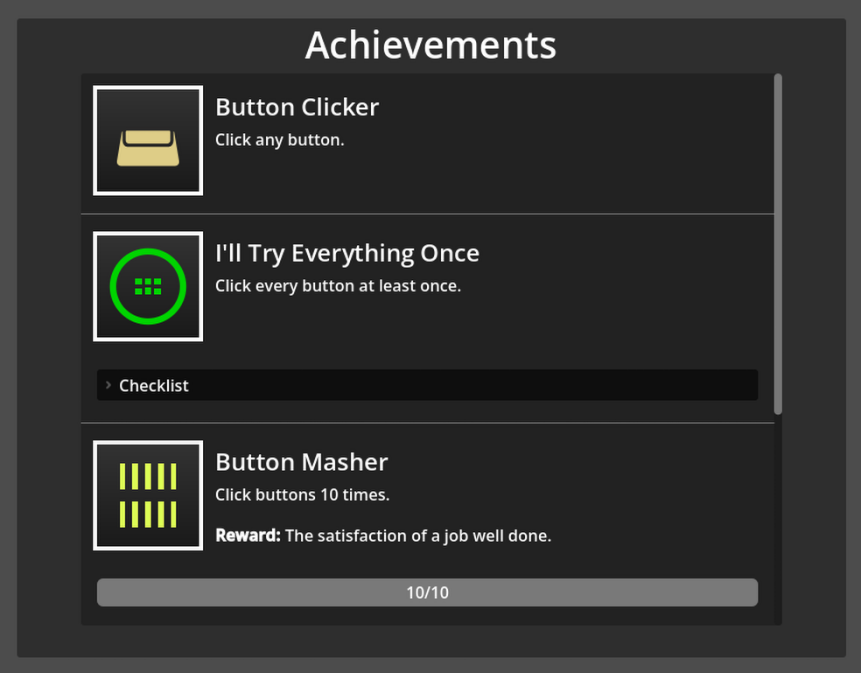

# SV Achievements
Achievements framework and related UI elements for the Godot Engine. Currently
a work in progress.

## Dependencies
Requires Godot 4.6

## Usage
- Copy the `addons/sv_achievements` folder into your project's `addons` folder
  (create it if it doesn't already exist).
- Enable the plugin in project settings.
- Create an `AchievementList` resource
- Add the `AchievementList` to your project settings under
  `Sv Achievements > General > Achievements`.

## License
See [`LICENSE.txt`](LICENSE.txt)
